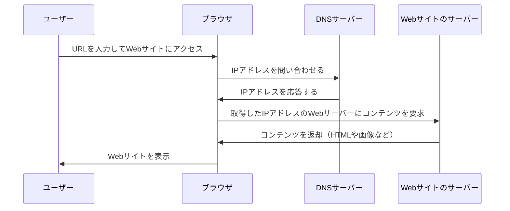

# HTTP の基礎

ブラウザは`HTTP`という通信規格に従いリソースの CRUD 操作を行います。
下記の矢印が`HTTP`を使った通信になります。

DNSやHTTPは`TCP/IP`という仕組みを使っています。[^1]
コンピュータはルールに従って通信する必要があります。送受信者それぞれ規約に従いやり取りする必要があるのですが、この規約のことを`通信プロトコル`といいます。
`HTTP`も通信プロトコルの一種です。
そしてTCPとIPを含む通信プロトコルの総称を`TCP/IP`と呼びます。
`TCP/IP`の階層は以下の四から成り立っています。

### アプリケーション層
- アプリケーションに応じた通信をする
  - 例: HTTP, SMTP
### トランスポート層
- インターネット層から受け取ったデータなどをアプリケーション層に渡すかどうか決めたりデータの誤りを検知したりする
    - 例: TCP(データを確実に相手に届けるとき使う), UDP(リアルタイム性重視するとき使う)
### インターネット層
- どのコンピュータにデータを届けるか決定する
    - 例: IP
### データリンク層
- データは物理的に送信可能な電気信号に変換してやり取りされるが、その電気信号を相手に届けたり信号の誤りや検知を行う
  - Ethernet(有線LAN), IEEE 802.11(無線LAN)

上の層のプロトコルはそれぞれヘッダを付与しながら下の層へプロトコルデータを渡し、受信側は各層でヘッダを取り出しながら上の層へデータを渡します。

## HTTPメッセージ

HTTPではブラウザとサーバ間でHTTPメッセージという決まった形式でデータをやり取りします。
HTTPメッセージにはリクエストとレスポンスの2種類があります。

### HTTPリクエスト

HTTPによるブラウザとサーバの通信はリクエストから始まります。
HTTPリクエストは下記で構成されています。

- リクエストライン
  - HTTPメソッド、リソースパス、HTTPのバージョン情報
- ヘッダ
  - ブラウザ情報や接続に関する情報
- ボディ
  - リクエストの本文にあたる情報

### HTTPレスポンス

リクエストに応じてサーバから返却された情報です。
HTTPレスポンスは下記で構成されています。

- ステータスライン
    - 処理結果を表すステータスコード、HTTPのバージョン情報
- ヘッダ
    - ブラウザ情報や接続に関する情報
- ボディ
    - レスポンスの本文にあたる情報

## HTTPメソッド

- GET,POST,PUT,DELETE,
  - リソースを取得/作成/更新/削除する
- HEAD
  - HTTPヘッダを取得する
- CONNECT
  - HTTP上に他のプロトコルを流せるようにする（プロキシサーバ経由でHTTPS通信をする際に使われることが多い）
- OPTIONS
  - 通信オプションを確認する
- TRACE
  - サーバが受け取ったデータをそのまま返す
  - XSTを引き起こす攻撃に利用される可能性があるため、ほとんどのブラウザはサポートしていない

## HTTPヘッダ

ボディの付随的な情報やデータのやり取りに必要です。

### リクエストヘッダ

- Host
  - リクエスト先のサーバのホスト名とポート名を指定する
    - 例: `Host: example.com`
- User-Agent
  - リクエスト元のブラウザバージョン情報
- Referer
  - アクセス元のWebアプリケーションのURLをサーバに伝える

### レスポンスヘッダ

- Server
  - レスポンスに使われていたサーバのソフトウェア情報
    - 例: `Server: nginx`
- Location
  - リダイレクト先のURL

### エンティティヘッダ

リクエストとレスポンスどちらにも使える

- Content-Length
  - リソースのバイト数
- Content-Type
  - リソースのメディア種別
    - `Content-Type: text/html;`

# HTTPSについて

HTTPSは通信が暗号化されています。
HTTPSは、HTTPで通信を安全に行うための仕組みです。
- HTTPは通信が暗号化されていないため、第三者が容易に通信内容を見られるため悪用される可能性がある
- HTTPは第三者が通信内容を改ざんできる
- HTTPはWebサーバの身元が確認できないため、アクセス先が確実に該当のWebサーバかどうかは保証されない

## 暗号化

HTTPSはTLSまたはSSLを使用してHTTP要求と応答を暗号化します。
TLSの公開鍵はサーバーのSSL証明書を介してクライアントデバイスと共有されます。
クライアントがサーバーとの接続を開くと、2つのデバイスは公開鍵と秘密鍵を使用して、セッション鍵と呼ばれる新しい鍵について合意し、両者間の以降の通信を暗号化します。

# HTTP フラッド攻撃について

HTTPフラッド攻撃とはHTTPリクエストで標的のサーバーを圧倒するように設計された、ボリューム分散サービス妨害（DDoS） 攻撃の一種です。
標的がリクエストで飽和状態になり、通常のトラフィックに応答できなくなると、実際のユーザーからの追加リクエストに対してサービス拒否が発生します。
HTTPフラッド攻撃は、7層DDoS攻撃の一種です。7層は OSI 参照モデルのアプリケーション層であり、HTTPなどのインターネットプロトコルを指します。
悪意のあるトラフィックは通常のトラフィックと区別するのが難しいため、アプリケーション層攻撃の軽減は特に複雑です。
HTTP GET攻撃とPOST攻撃の二種類があり、それぞれに対策が必要になります。
captchaテストのように、リクエストするタイミングでボットかどうかをテストする実装などが対策の一つとして挙げられます。

# 参考

- [フロントエンド開発のためのセキュリティ入門](https://amzn.asia/d/35PZwDK)
- [HTTPとは？](https://www.cloudflare.com/ja-jp/learning/ddos/glossary/hypertext-transfer-protocol-http/)
- [HTTPフラッド攻撃](https://www.cloudflare.com/ja-jp/learning/ddos/http-flood-ddos-attack/)
- [HTTPが安全ではない理由は？| HTTPとHTTPS](https://www.cloudflare.com/ja-jp/learning/ssl/why-is-http-not-secure/)

***

[^1]: デフォルトではTCPポート80が使われていますが、他のポートを指定することもできます。一方、HTTPSは443番ポートを使用します。

