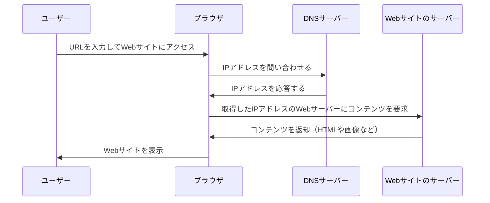

# HTTP の基礎

ブラウザは`HTTP`という通信規格に従いリソースの CRUD 操作を行います。
下記の矢印が`HTTP`を使った通信になります。

```mermaid
    sequenceDiagram
    participant ユーザー
    participant ブラウザ
    participant DNSサーバー
    participant Webサイトのサーバー
    ユーザー->>ブラウザ: URLを入力してWebサイトにアクセス
    ブラウザ->>DNSサーバー:　IPアドレスを問い合わせる
    DNSサーバー->>ブラウザ: IPアドレスを応答する
    ブラウザ->>Webサイトのサーバー: 取得したIPアドレスのWebサーバーにコンテンツを要求
    Webサイトのサーバー->>ブラウザ: コンテンツを返却（HTMLや画像など）
    ブラウザ->>ユーザー:　Webサイトを表示
```

DNSやHTTPは`TCP/IP`という仕組みを使っています。
