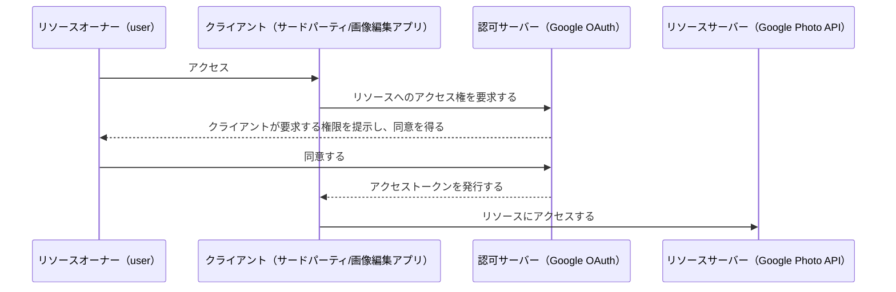
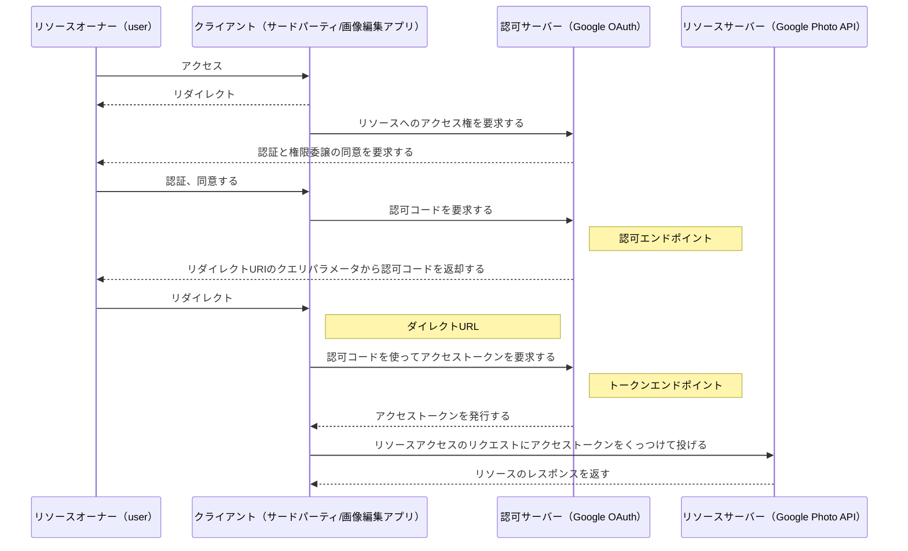
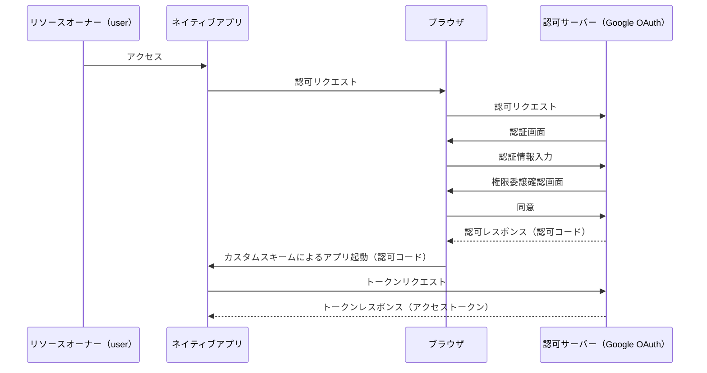
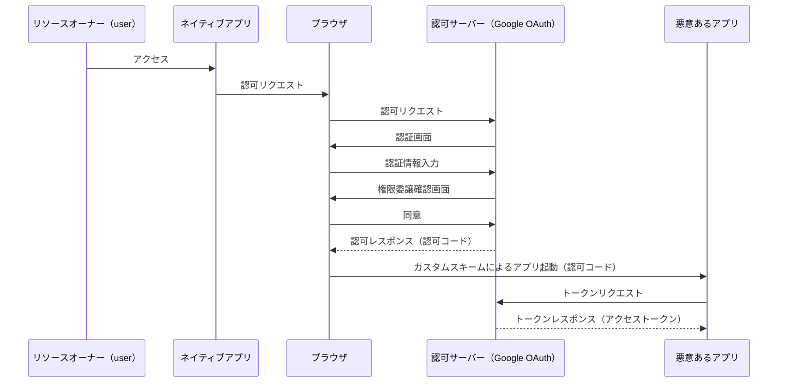
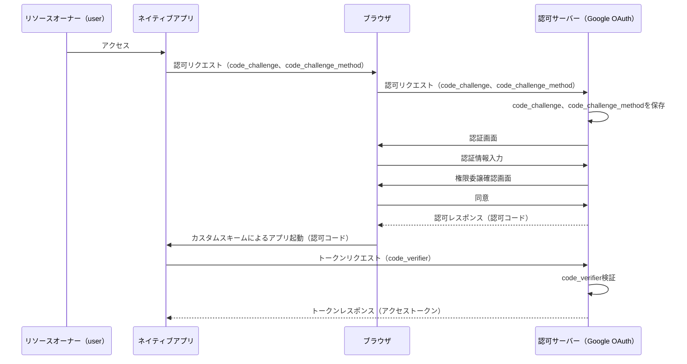
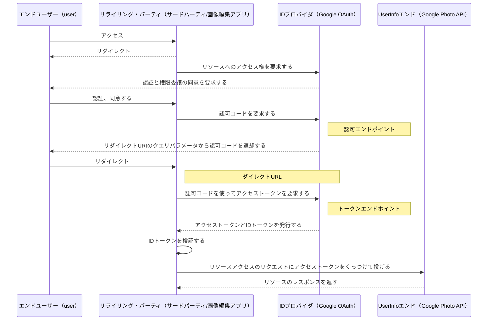

## 概要

本記事は[雰囲気で使わずきちんと理解する！整理して OAuth2.0 を使うためのチュートリアルガイド (技術の泉シリーズ（NextPublishing）](https://amzn.asia/d/36yw7fO)の内容を要約したないようになっています。きちんと OAuth2.0 を理解したい方は上記の著書を一読することをおすすめします。非常にわかりやすい内容でした。
クライアントクレデンシャル、リソースオーナーパスワードクレデンシャル、トークン再発行の内容は今回は省きます。
また、OAuth2.0 について説明した上で、OpenID Connect との差分をざっと説明したいと思います。

## OAuth2.0 とはなにか

OAuth2.0 とは、サードパーティーアプリケーションが HTTP サービスへの限定的なアクセスを可能にする認可フレームワークです。

例えば、Google Photo から画像を取得するして画像編集を行うサードパーティアプリあったとます。それを簡単にシーケンス図にすると、下記のような仕組みになります。



## 認可フレームワーク

Google Photo の API はインターネット上に公開されているため、悪意あるアクセスをされる可能性があります。そのためアクセス時に渡されるアクセストークンの値を見て、許可して良いアクセスかどうか判断をします。
認可フレームワークとは、アクセストークンの発行方法のルールです。このルールに従って、Google OAuth はアクセストークンを払い出します。このとき、Google のサービスはユーザーから委譲された権限に従い、サードパーティからの限定的なアクセスを許可します。
OAuth を利用することで、ユーザーはサードパーティに HTTP サービスの ユーザー名（ID）やパスワードを教える必要がなくなります。

## ロールの確認

| role             | content                                                                                                                      |
| ---------------- | ---------------------------------------------------------------------------------------------------------------------------- |
| リソースオーナー | リソースの所有者。 サードパーティに対してアクセス権限の選択と委譲を行う。                                                    |
| クライアント     | リソースサーバーを利用するアプリケーション。 許可された範囲でリソースへのアクセス権を与えられる。                            |
| 認可サーバー     | リソースオーナーを認証する。クライアントのリソースアクセスについてリソースオーナーの同意を得る。アクセストークンを発行する。 |
| リソースサーバー | リソースを扱う Web API。                                                                                                     |

#### クライアントタイプ

クライアント ID、クライアントシークレットをセキュアに持てるかどうかで区分されます。サーバーサイドにクライアント ID、クライアントシークレットを保存するセキュアなクライアントをコンフィデンシャルクライアントと呼び、ブラウザベースのようなアプリケーションをパブリッククライアントと呼びます。

## OAuth のトークン

### アクセストークン

クライアントからリソースサーバーへのリクエストはすべてアクセストークンをつける必要があります。そしてアクセストークンは、誰のどのリソースに対してどのような操作が許可されているかということと、有効期限に関する情報を持っています。
OAuth のアクセストークンは Bearer トークン（署名なしトークン）という仕様になっており、トークンを所持する任意のクライアントは「トークンを所持している」という条件を満たしていればトークンを利用することができます。つまり、トークン所持者についての確認は行いません。

#### アクセストークンの属性

##### スコープ

アクセストークンに紐づくアクセス権限を細かくコントロールする仕組みです。
スコープ値によって、アクセスできる API のエンドポイントが変わります。
一般的には「読み込みアクセス」「書き込みアクセス」「読み書きアクセス」「アクセス不可」の 4 種類があります。
各サービスのリソースサーバーごとに設定値のルールは違います。

```sh
# 実際の設定値の例
- user-top-read # from Spotify API
- https://www.googleapis.com/auth/photoslibrary.readonly # from Google Photo API
```

##### 有効期限

有効期限を過ぎたトークンを利用してリソースサーバーにアクセスすると、リソースサーバーから拒否されます。
アクセストークンは、リフレッシュトークンよりも短い期間が設定されることが一般的で、1 時間~24 時間程度の期限が設けられることが多いです。レスポンスの`expires_in`に有効期限の値が返されます。

### リフレッシュトークン

クライアントから認可サーバーに対してアクセストークンの再発行を求める際に利用します。
リフレッシュトークンの発行は標準仕様では必須ではなく、利用する API によってはリフレッシュトークンを発行する機能が提供されていないこともあります。
アクセストークンはクライアントからリソースサーバーに送るものですが、リフレッシュトークンは認可サーバーに送るものです。
有効期限は一ヶ月などの長期間になっています。

### 認可コード

リソースオーナーがクライアントへの権限移譲に同意した証として発行されます。これはクライアントから認可サーバーに対してアクセストークンを要求する際に利用されます。
認可サーバーはリソースオーナーの ユーザー名（ID） とパスワードを確認し、アクセス権限の委譲に対して同意を得ます。
認可コードは一度の発行につき一回しかアクセストークンを要求することはできません。
認可コードの有効期限は標準仕様では 10 分を推奨しています。

## OAuth エンドポイント

### 認可エンドポイント

認可サーバーによって提供されるエンドポイントで、認可コードの発行が主な役割です。
クライアントがアクセス権をもっていないリソースにアクセスするとき、まず認可エンドポイントを叩く必要があります。ここではユーザー名とパスワードの入力などによってリソースオーナーの認証を行います。認証完了後に、リソースオーナーはアクセス権限の委譲に同意します。その同意の証明として認可コードがリダイレクトエンドポイントに送られます。

### リダイレクトエンドポイント

クライアントが提供するエンドポイントで、リダイレクト URI とも呼ばれています。リダイレクト URI は認可サーバーから認可コードを受け取るために使われます。認可サーバーはリソースオーナーからのアクセス権限委譲の同意が完了すると、HTTP ステータスコード 302 を返してリダイレクト URI にリダイレクトします。その際、クエリパラメーターとして認可コードが渡されます。

### トークンエンドポイント

認可サーバーによって提供されるエンドポイントで、認可コードと必要なパラメーターを指定してトークンエンドポイントにリクエストを投げることでアクセストークンが発行されます。
トークンエンドポイントでは Basic 認証によってクライアントが認証されます。Authorization ヘッダーにクライアント ID とクライアントシークレットを設定することでクライアントを識別します。クライアント ID とクライアントシークレットは認可サーバーに事前登録する際に発行されます。

## OAuth のグラントタイプ

グラントタイプとは権限委譲の種別のことで、標準仕様では下記の 4 種類が定義されています。

- 認可コードグラント
- インプリシットグラント
- クライアントクレデンシャル
- リソースオーナーパスワードクレデンシャル

### クライアント登録

クライアント開発者はリソース提供側のサービス上でクライアント情報を登録し、クライアント ID とクライアントシークレットを発行してもらう必要があります。
発行時にはリダイレクト URI の指定を求められます。
ここで発行されたクライアント ID とクライアントシークレットは、クライアントから認可サーバーに対するリクエストヘッダーに設定する必要があります。

### 認可コードグラント

標準仕様上ではコンフィデンシャルクライアントに最適化されたグラントとされています。これはパブリッククライアントでの利用を禁止するものではなく、`PKCE` を使うことであらゆるクライアントで推奨されるグラントタイプになっています。（後述）
パブリッククライアントでの利用を想定して、クライアントシークレットをリクエストのパラメータに含めないケースも標準仕様で認められています。
認可コードグラントの特徴はセキュアであることです。

#### セキュアである理由

- ブラウザを介さず直接クライアントと認可サーバー間でアクセストークンを受け渡しするため
- 認可サーバーがリソースオーナーの認証を行うため
- 認可サーバーが HTTP Basic 認証によってクライアント ID、クライアントシークレットを確認するため
- クライアントが URI と SSL 証明書によってアクセス先の認可サーバーのアイデンティティを確認するため

#### 認可コードグラントで権限委譲をする場合のシーケンス

記事の冒頭にあるシーケンス図を、より詳細にしたものと思って下さい。



#### 認可エンドポイントへのリクエストパラメーター

| parameter     | content                                                                                                                    |
| ------------- | -------------------------------------------------------------------------------------------------------------------------- |
| response_type | `code`を設定する。この値を持って認可コードの発行が求められていることを判別する。                                           |
| client_id     | クライアント ID を設定する。                                                                                               |
| state         | クライアントが生成したランダムな値を設定する。ユーザーのセッションと紐付けて管理することでクロスサイトフォージェリを防ぐ。 |
| scope         | クライアントが要求するスコープ値を設定する。                                                                               |
| redirect_uri  | リソース提供側のサービス上で登録したリダイレクト URI を設定する。                                                          |

#### セッション

認可コード発行時にリダイレクト URI にリダイレクトされたとき、認可コードはリソースオーナーのブラウザを介してからクライアントに渡ります。
この際、クライアント側で事前にセッションと紐付けて生成した state 値と、リダイレクト URI で返された state 値が一致することで、同位置セッション内での処理であることを確認します。
これによって、クロスサイトリクエストフォージェリを防ぐことが出来るようになります。

#### トークンエンドポイントへのリクエストパラメーター

`client_id`と`client_secret`に関してはリクエストボディに含める形式も認められており、必ずしも Authorization ヘッダーに設定する必要はない。

| parameter     | content                                                                                            |
| ------------- | -------------------------------------------------------------------------------------------------- |
| grant_type    | `authorization_code`を設定する。この値で、認可コードグラントによるリクエストであることを判別する。 |
| code          | 認可コードの値を設定する。                                                                         |
| redirect_uri  | 認可リクエスト時と同様のリダイレクト URI を設定する。                                              |
| client_id     | クライアント ID を設定する。                                                                       |
| client_secret | クライアントシークレットを設定する。                                                               |

#### トークンレスポンス

| parameter     | content                                                |
| ------------- | ------------------------------------------------------ |
| access_token  | リソースアクセスのためのトークン。                     |
| token_type    | `Bearer`という文字が設定される。                       |
| expires_in    | 秒単位での有効期限を示す値が設定される。               |
| refresh_token | リフレッシュトークン。必ずしも入っているとは限らない。 |

### 認可コードグラント + PKCE

`PKCE`とは`Proof Key for Code Exchange`の略で、ピクシーとも読みます。
主に、認可コード横取り攻撃を受けやすいネイティブアプリで使うためのグラントタイプです。Twitter は`PKCE`を利用することを推奨しています。



ネイティブアプリの場合、認可サーバーが認可コードを発行したら Location ヘッダーにクエリパラメーターを付与された形でリダイレクト URI が入ってきます。
Location ヘッダーに設定された URI プロトコルはカスタムスキーム（myapp://）になっており、クエリパラメータには state と code の値が付与されています。

#### 認可コード横取り攻撃

悪意あるアプリに<u>対象のネイティブアプリと同じカスタムスキームが設定されており、クライアント ID が知られている場合</u>、下記のようなことが起きる場合があります。
OS の挙動により悪意あるアプリが起動されてしまった場合、トークンリクエストが可能になってしまいます。



#### PKCE による対策

`PKCE`の導入時、認可リクエストとトークンリクエストのパラメーターとして以下を付与します。

| parameter             | content                                                                                                                                                                                      |
| --------------------- | -------------------------------------------------------------------------------------------------------------------------------------------------------------------------------------------- |
| code_verifier         | 長さ 43 文字~128 文字までの[A-Z]/[a-z]/[0-9]/"-"/"."/"\_"/"~"からなるランダム文字を設定します。                                                                                              |
| code_challenge_method | `plain`または`S256`を設定します。基本的に`S256`を設定するべきとされています。                                                                                                                |
| code_challenge        | `code_challenge_method`の計算方法をもとに算出された値を設定します。`plain`の場合計算せず、`S256`の場合 `SHA256` のハッシュ値を計算し、それに Base64 URL エンコードを施したものを設定します。 |

`PKCE`による`code_verifier`の検証を含んだシーケンスは以下の通りになります。



認可リクエストとトークンリクエストを送ったクライアントが同一かどうか検証を行います。
悪意あるアプリがカスタムスキームによって起動した際、悪意あるアプリは`code_verifier`を知らないので、トークンリクエスト時に`code_verifier`がないか違う`code_verifier`を送ることになり、検証に失敗して Error が返されるという流れになります。
`code_challenge_method`に`plain`を指定してしまうと、ブラウザでの処理や、通信を覗き見られることで、認可リクエスト時に`code_challenge`が悪意あるアプリに流出する可能性があります。悪意あるアプリはトークンリクエスト時に正しい`code_verifier`を送信することができるので、アクセストークンの取得に成功していしまいます。そのため`code_challenge_method`は`S256`を使うべきです。

## OpenID Connect について

OpenID Connect とは、OAuth2.0 をベースにして認可に加えて認証も行えるようにした拡張仕様です。
OAuth とは、権限委譲（認可）のためのプロトコルであり、ユーザーの認証（身元の確認）のフレームワークではありません。OAuth 認証という言葉がありますがそれを行う場合、リソースサーバーにプロフィール情報を返す API があり、クライアントがそのプロフィールを利用する形で認証する必要があります。このとき悪意あるアプリが他人のアクセストークンを手に入れた場合、悪意あるユーザーが他人のアカウントでログインできてしまうという脆弱性を孕んでいます。
このためサービスによってはトークンを検証するエンドポイントを提供しているサービスもあります。
OAuth に対して、OpenID Connect はクライアントが認証できるプロトコルであり、認可も提供しています。
基本的に OAuth とシーケンスは同じ流れで、違いはロールの名称と、トークン発行時に ID トークンが渡される点です。



### ID トークンとは

- 署名付きの JSON Web Token(JWT)
- ユーザー ID や検証に必要な情報や署名、有効期限や権限が含まれる
- 検証を行うことで、意図するやり取りが行われたことを確認できる
